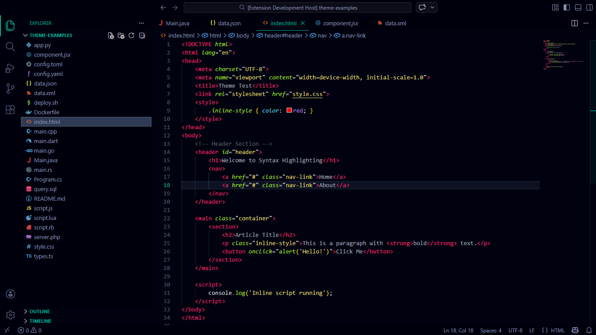
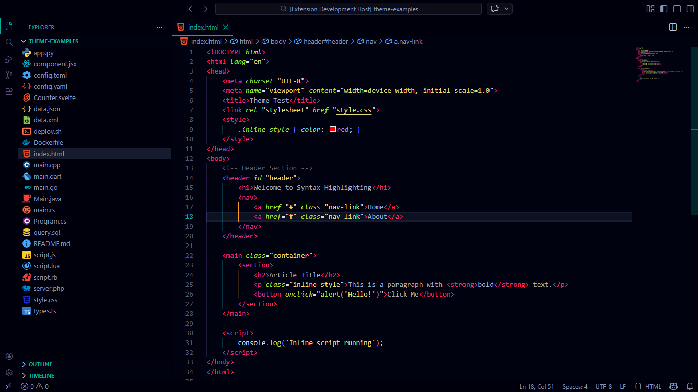

<h1>Hadar Theme Pack</h1>

Protege tu vista con un tema oscuro traído desde la constelación de Centauro, para darte comodidad al programar en la oscuridad.

Este **Extension Pack** es la forma más sencilla de obtener la experiencia visual completa de Hadar. Al instalarlo, se añadirán automáticamente las dos extensiones esenciales de la familia Hadar.

## 📦 Extensiones Incluidas

Este paquete instala las siguientes 2 extensiones:

### 1. [Hadar Theme](https://marketplace.visualstudio.com/items?itemName=cristianvasquez.hadar-theme)

El tema de color principal. Un diseño oscuro, con contrastes cuidados para reducir la fatiga visual durante largas sesiones de código.

### 2. [Hadar Icons](https://marketplace.visualstudio.com/items?itemName=cristianvasquez.hadar-icons)

El complemento perfecto. Un paquete de iconos diseñado para armonizar con los colores y el estilo minimalista de Hadar.

## 🚀 Instalación

Simplemente instala este paquete y Visual Studio Code se encargará de descargar y activar tanto el tema como los iconos.

## 🔗 Enlaces

- [Página Web Oficial](https://hadartheme.netlify.app/)
- [Repositorio GitHub](https://github.com/cristianvasquezc)

---

    Hecho con ❤️ por <a href="https://mislinks.netlify.app/">Cristian Vásquez</a>

